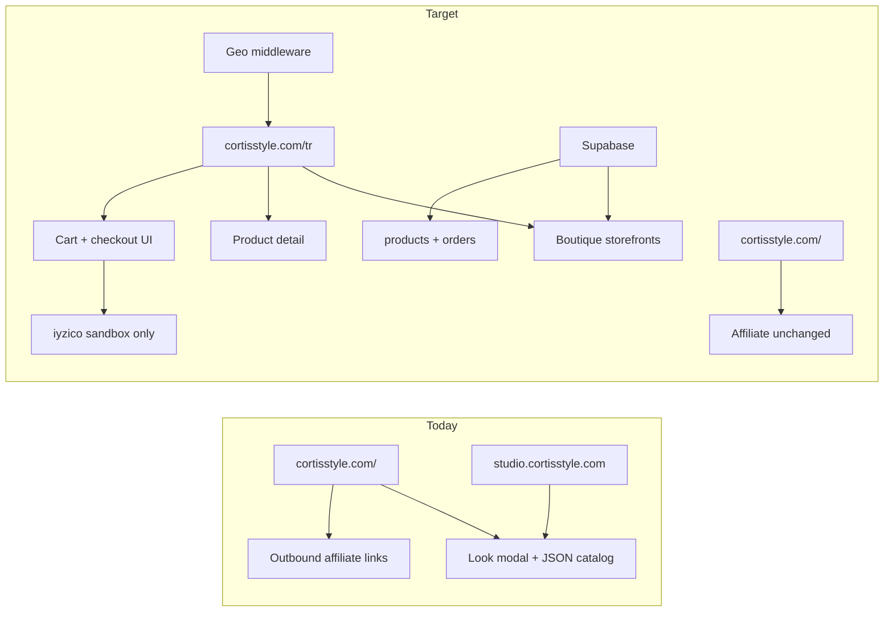
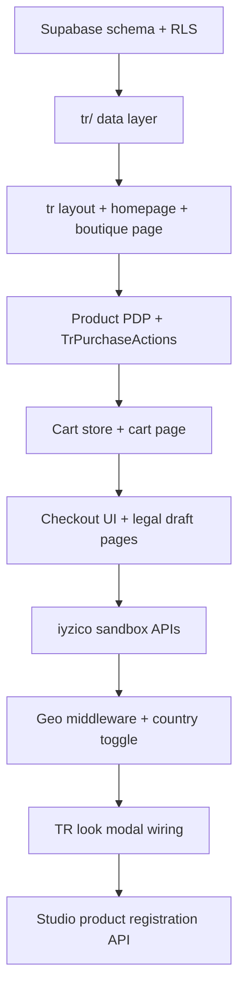

# Turkey Marketplace Integration Plan

## Current state vs target



**What exists and reuses cleanly:**
- Look presentation: [`src/components/modal/LookItemsPanel.tsx`](src/components/modal/LookItemsPanel.tsx), [`LookItemCard.tsx`](src/components/modal/LookItemCard.tsx), [`LookCard.tsx`](src/components/LookCard.tsx)
- Studio curation: [`studio/`](studio/) export pipeline
- Legal shell: [`src/components/legal/LegalPageShell.tsx`](src/components/legal/LegalPageShell.tsx), [`src/lib/siteLegal.ts`](src/lib/siteLegal.ts)
- Auth: existing Supabase auth (buyer accounts optional v1)
- Middleware hook point: [`src/middleware.ts`](src/middleware.ts)

**What does not exist yet:** `/tr` routes, geo routing, TR data model, cart, iyzico, TR legal pages, item CTA split (Buy vs affiliate).

---

## Guiding rules (from your three docs)

| Rule | Implication for build |
|------|------------------------|
| Pre–vergi levhası | Sandbox payments only; no production iyzico; no public "buy now" on live credentials |
| No vergi levhası = no listing | Admin/boutique `status` gate; products hidden until boutique verified |
| Separate TR vs international | Never mix `Satın Al` and affiliate buttons on the same CTA surface |
| Outfit-first | TR looks = cross-boutique compositions, not a flat product grid only |
| Supabase-first (your choice) | Schema + RLS before UI; JSON only for seed/bootstrap scripts |

---

## Phase 1 — Data foundation (Week 1)

### 1.1 Supabase schema

Add migration(s) under `supabase/` (new patch file, e.g. `patch_tr_marketplace.sql`):

```sql
-- boutiques: slug, legal_name, vergi_no, iban, status (draft|pending|verified|suspended)
-- products: boutique_id, title, price_try, size, condition, images[], status (available|sold|hidden)
-- tr_look_items: optional join — product_id linked into a TR look composition
-- orders + order_items: for sandbox flow (payment_status: sandbox|pending|paid|failed|refunded)
```

**Status gates (enforce in app + RLS):**
- `boutiques.status = 'verified'` required before public product visibility
- `products.status = 'available'` for add-to-cart; flip to `sold` on successful sandbox payment

### 1.2 Server data access layer

New modules mirroring existing patterns ([`src/lib/wardrobe.ts`](src/lib/wardrobe.ts), [`src/lib/studioDraftDb.ts`](src/lib/studioDraftDb.ts)):

- `src/lib/tr/boutiques.ts` — list/get by slug
- `src/lib/tr/products.ts` — list by boutique, get by id, mark sold
- `src/lib/tr/orders.ts` — create order from cart (sandbox)

### 1.3 Seed / admin bootstrap

- Minimal admin-only script or API route (protected by env secret or Supabase service role) to insert first boutiques + products from mom's network conversations
- No seller dashboard v1 — spreadsheet → seed script is fine per roadmap

---

## Phase 2 — `/tr` route tree + layout (Week 1–2)

Create App Router segment [`src/app/tr/`](src/app/tr/):

| Route | Purpose |
|-------|---------|
| `/tr` | Marketplace homepage — hero TR looks + boutique grid |
| `/tr/[boutiqueSlug]` | Boutique storefront |
| `/tr/shop/[productId]` | Product detail (photos, TRY price, size, condition, **Satıcı: [boutique]** ) |
| `/tr/cart` | Cart page |
| `/tr/checkout` | Address + ön bilgilendirme + pay (sandbox) |
| `/tr/siparis-onay` | Order confirmation |
| `/tr/yakinda` | Optional "coming soon" if you want zero checkout CTA pre-launch |

**Layout:** [`src/app/tr/layout.tsx`](src/app/tr/layout.tsx)
- `lang="tr"` on TR subtree (or `html` lang via layout wrapper)
- TR header with **country toggle** (Türkiye / International)
- Reuse footer pattern; add TR legal links (draft routes OK behind flag)

**Reuse components:**
- Extract shared look footer/credits from [`LookCardCredits.tsx`](src/components/LookCardCredits.tsx) if needed
- New `TrLookCard`, `TrLookModal` wrappers that call TR product resolution instead of affiliate `shopUrl`

---

## Phase 3 — Geo routing + country preference (Week 2)

Extend [`src/middleware.ts`](src/middleware.ts):

1. Read `x-vercel-ip-country` (Vercel) — if `TR` and path is `/`, redirect or rewrite to `/tr` (respect user override cookie)
2. Cookie `cortisstyle_market=tr|intl` set by header toggle
3. Never geo-redirect `/api`, `/auth`, `/studio`, `/wardrobe`, legal pages, or static assets

New: `src/lib/marketPreference.ts` — read/write cookie, resolve effective market.

**UX:** Diaspora / VPN users can force International; Turkish users can force TR.

---

## Phase 4 — Commerce UI (pre-live payments) (Week 2–3)

### 4.1 Cart store

New Zustand store in main app (not Studio): `src/store/trCartStore.ts`
- Line items: `{ productId, boutiqueId, title, priceTry, image, size }`
- Persist to `localStorage` (v1)
- Validate availability server-side on checkout

### 4.2 Product CTA component

New `src/components/tr/TrPurchaseActions.tsx` — replaces affiliate buttons when `market === 'tr'`:

| Product state | UI |
|---------------|-----|
| `available` | **Sepete Ekle** |
| `sold` | Satıldı |
| `hidden` | Not shown |

**Do not** reuse [`itemPurchaseState.ts`](src/lib/itemPurchaseState.ts) for TR — international editorial/affiliate states stay separate.

### 4.3 TR look integration

Two-step approach to avoid breaking international JSON:

1. **v1:** TR looks stored in Supabase (`tr_looks` + `tr_look_products`) or a new `src/data/tr-looks/` JSON that references `productId`s
2. TR look modal reuses [`LookCanvas`](src/components/modal/LookCanvas.tsx) for collage; item panel uses `TrPurchaseActions` instead of [`LookItemCard`](src/components/modal/LookItemCard.tsx) affiliate buttons

Studio workflow (later in same phase):
- Export TR package includes `boutiqueId`, TRY price, Supabase product registration via new API [`/api/tr/products`](src/app/api/tr/products/route.ts) (admin-only)

---

## Phase 5 — iyzico sandbox only (Week 3)

**Blocked until env vars exist — use sandbox credentials only.**

New API routes:
- `POST /api/tr/checkout/initiate` — create order row, start iyzico sandbox payment
- `POST /api/tr/checkout/callback` — webhook; mark `payment_status`, set products `sold`

New: `src/lib/tr/iyzico.ts` — wrapper for sandbox SDK/REST

**Checkout UI requirements (even in sandbox):**
- Checkbox: mesafeli satış sözleşmesi acceptance (link to draft legal page)
- Ön bilgilendirme summary block (product, price, seller name per line item)
- Clear banner: **"Test ödeme — gerçek satış kapalı"** until production flag enabled

**Feature flag:** `TR_CHECKOUT_LIVE=false` in env — when false, checkout ends in sandbox or shows disabled state on production deploy.

---

## Phase 6 — Legal drafts (Week 2–3, publish later)

Draft pages under `/tr/hukuk/...` using [`LegalPageShell`](src/components/legal/LegalPageShell.tsx):

- Mesafeli satış sözleşmesi
- Ön bilgilendirme formu (also inline on checkout)
- İade / cayma hakkı (14 gün)
- KVKK aydınlatma metni (TR-specific section)
- Platform kullanım koşulları
- Hakkımızda + iletişim (operator identity placeholders)

**Publish gate:** `TR_LEGAL_PUBLISHED=true` only after vergi levhası + real operator details — until then, routes can 404 or show "draft" in non-prod.

International lane unchanged: [`/affiliate-disclosure`](src/app/affiliate-disclosure/page.tsx), privacy, terms.

---

## Phase 7 — Content & boutique pipeline (parallel, Week 1–4)

Aligned with [pre-vergi-levhasi-checklist.md](docs/pre-vergi-levhasi-checklist.md):

1. Boutique onboarding checklist (docs → `docs/boutique-onboarding-checklist.md` or Notion)
2. Conversations via mom's network — collect photos, prices, sizes
3. Curate 5–10 cross-boutique looks in Studio → register products in Supabase
4. Boutique contract draft (legal, not code) — **no public listing until signed + `verified`**

**Admin verification flow (minimal v1):**
- You manually set `boutiques.status = 'verified'` after reviewing vergi levhası copy (stored as private field / Supabase storage, not public)

---

## Phase 8 — International lane (parallel, no conflict)

Per checklist Tier 1–2, continue on `/`:

- Keep building lookbook + affiliate prep
- Audit [`dynamic-looks/*-items.json`](src/data/dynamic-looks/) for placeholder/broken `shopUrl`s before affiliate go-live
- Affiliate disclosure already in [`LookItemsPanel`](src/components/modal/LookItemsPanel.tsx) — do not show on `/tr` product CTAs

---

## Phase 9 — Registration day flip (post–vergi levhası)

When vergi levhası + ticari hesap + KEP + ETBİS + iyzico production approval land:

1. Publish TR legal pages with real operator info in [`siteLegal.ts`](src/lib/siteLegal.ts) (TR fields)
2. Set `TR_CHECKOUT_LIVE=true`, swap iyzico to production keys
3. Remove sandbox banner; enable **Satın Al** on production
4. Submit ETBİS + iyzico with live URLs
5. Soft launch: 1 test order → mom's boutique network (3–5 boutiques)
6. Manual weekly payout to boutiques (spreadsheet + bank transfer) — auto-split is Phase 7 in roadmap

---

## Suggested build order (engineering)



---

## Files likely touched (high signal)

| Area | New / modified |
|------|----------------|
| DB | `supabase/patch_tr_marketplace.sql` |
| Routes | `src/app/tr/**` |
| Middleware | [`src/middleware.ts`](src/middleware.ts) |
| Cart | `src/store/trCartStore.ts` |
| TR lib | `src/lib/tr/*`, `src/lib/marketPreference.ts` |
| API | `src/app/api/tr/checkout/*`, `src/app/api/tr/products/*` |
| Components | `src/components/tr/*` |
| Types | `src/types/tr-marketplace.ts` |
| Env | `IYZICO_SANDBOX_*`, `TR_CHECKOUT_LIVE`, `TR_LEGAL_PUBLISHED` |

---

## What we explicitly skip in v1 (per roadmap)

- iyzico marketplace auto-split
- Seller dashboard
- Automated returns portal
- İYS / marketing SMS
- E-fatura for commission invoices
- Mixing TR checkout with international affiliate on one page

---

## Success criteria before vergi levhası

Matches [pre-vergi-levhasi-checklist.md](docs/pre-vergi-levhasi-checklist.md) "ready to launch" block:

- `/tr` styled and navigable
- 3 boutiques in Supabase (`verified` or `pending` with test data)
- 10–20 products with photos + TRY prices
- 5–10 cross-boutique TR looks
- End-to-end sandbox checkout works
- Legal drafts written (unpublished or behind flag)
- Boutique contract ready to sign
- **No** live production payments

---

## Risk callouts

1. **Shopier placeholder URLs** in international JSON (`shopier.com/cortis/...`) are not the TR shop — do not wire them to `/tr` checkout; TR products live only in Supabase.
2. **Multi-boutique cart** = multiple shipments — document in ön bilgilendirme; acceptable v1.
3. **RLS**: public read only for `verified` boutiques + `available` products; writes via service role / admin APIs only.
4. **Tax**: affiliate income and future TR commission both need muhasebeci — out of code scope but noted in checklist.
