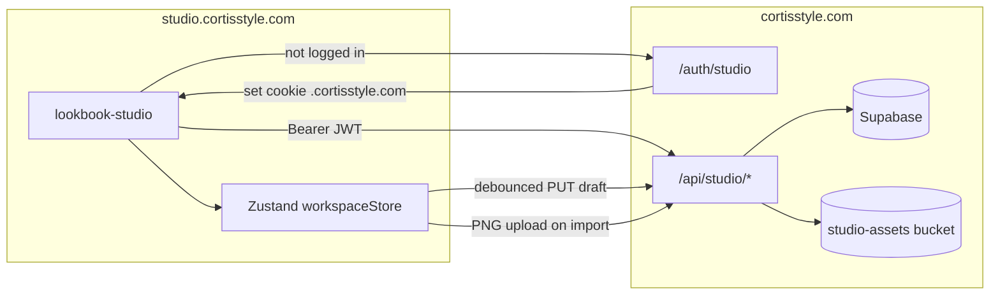

# Lookbook Studio + Cortisstyle Integration

## Auth stack (audit)

| Layer | Technology |
| ----- | ---------- |
| Provider | **Supabase Auth** (`@supabase/supabase-js` v2) |
| Client session | `getSupabaseClient()` → `persistSession: true` with shared cookie storage on `.cortisstyle.com` |
| Sign-in | Email + password, OTP signup (`AuthContext`, `AuthPopup`) |
| Callback | `/auth/callback` (PKCE / magic link) |
| Server admin | `getServiceSupabase()` + `SUPABASE_SERVICE_ROLE_KEY` |
| Middleware | Maintenance + wardrobe gates only — **no auth middleware** |
| Roles | No general user role column. **Lookbook Studio** uses `studio_curators` table (+ optional `STUDIO_CURATOR_EMAILS` env for dev) |

## Looks / assets today

| Data | Location |
| ---- | -------- |
| Legacy looks | `src/data/looks.ts` (hardcoded) |
| Dynamic looks | `src/data/dynamic-looks/{outfitId}.json` + `{outfitId}-items.json` |
| Canvas layouts | `src/data/canvas-layouts/{lookId}.json` |
| Garment PNGs | `public/images/clothes/{outfitId}/` (local static) |
| User wardrobe | Supabase `user_wardrobe` |
| Saved outfits | Supabase `user_saved_outfits` + localStorage fallback |

## Subdomain + cookie strategy

- **Studio:** `studio.cortisstyle.com` (Vite SPA)
- **Main site:** `cortisstyle.com` (Next.js)
- **Shared session:** Supabase auth token stored in cookies with `domain=.cortisstyle.com` via `createSharedAuthStorage()` in both apps
- **Local dev handoff:** `/auth/studio?returnTo=http://localhost:5173` redirects back with `#access_token=…` hash (Supabase `detectSessionInUrl`)
- **Login redirect:** unauthenticated studio → `cortisstyle.com/auth/studio?returnTo=<studio-url>`

## Data flow



## Draft API

| Method | Route | Purpose |
| ------ | ----- | ------- |
| GET | `/api/studio/session` | Validate JWT, return user |
| GET | `/api/studio/drafts` | List draft summaries |
| POST | `/api/studio/drafts` | Create draft |
| GET | `/api/studio/drafts/:id` | Load draft |
| PUT | `/api/studio/drafts/:id` | Autosave draft |
| POST | `/api/studio/assets/upload` | Upload garment/mood PNG |

## DB schema (`studio_drafts`)

```sql
studio_drafts (
  id uuid PK,
  user_id uuid FK → profiles,
  look_id text,
  title text,
  payload jsonb,  -- version 1: lookId, lookParams, studioNodes, artboardItems
  created_at, updated_at
)
```

Asset paths: `studio-assets/{userId}/{draftId}/{itemId}-{uuid}.png`

## Draft payload (matches lookbook-studio store)

```typescript
{
  version: 1,
  lookId: "look-abc123",
  lookParams: { lookTitle, modelName, moodImageUrl, outfitId, vibe, ... },
  studioNodes: [{ id, worldX, worldY, name, category, ... }],
  artboardItems: [{ id, x, y, widthPx, zIndex, imageUrl, naturalWidth, naturalHeight }]
}
```

Publishing (later) will call `buildDynamicLookJson` / `buildDynamicItemsJson` from the loaded payload.

## Curator access (invite-only)

Lookbook Studio is **not** open to every signed-in user. Access is granted when either:

1. **`studio_curators` row** — preferred for production (manage in Supabase)
2. **`STUDIO_CURATOR_EMAILS` env** — optional comma-separated allowlist (handy for local dev)

Everyone else gets **403** on `/api/studio/*` and sees an access-denied screen on `/auth/studio` and the studio app.

### Grant a curator (Supabase SQL Editor)

Run `supabase/patch_studio_curators.sql`, then:

```sql
insert into public.studio_curators (user_id, email, notes)
select id, email, 'Founding curator'
from public.profiles
where lower(email) = lower('curator@example.com')
on conflict (user_id) do nothing;
```

### Revoke access

```sql
delete from public.studio_curators
where user_id = (select id from public.profiles where lower(email) = lower('curator@example.com'));
```

## Manual test plan

1. Run `patch_studio_drafts.sql` in Supabase
2. Set env vars on both projects (see `.env.example`)
3. Open studio → redirected to cortisstyle login → return to studio logged in
4. Import garment → PNG uploaded → `artboardItems.imageUrl` is CDN URL (not `blob:`)
5. Edit layout + look params → wait ~2s → autosave indicator
6. Copy URL with `?draft=<uuid>`, close tab, reopen → draft restored
7. Disconnect network, edit → localStorage backup; reconnect → PUT succeeds
